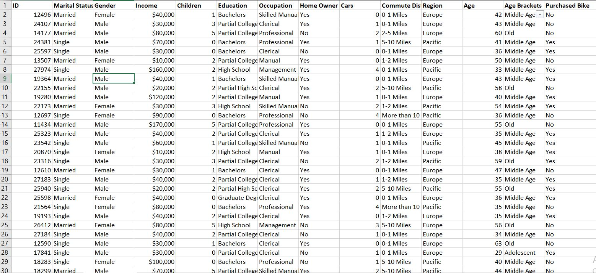
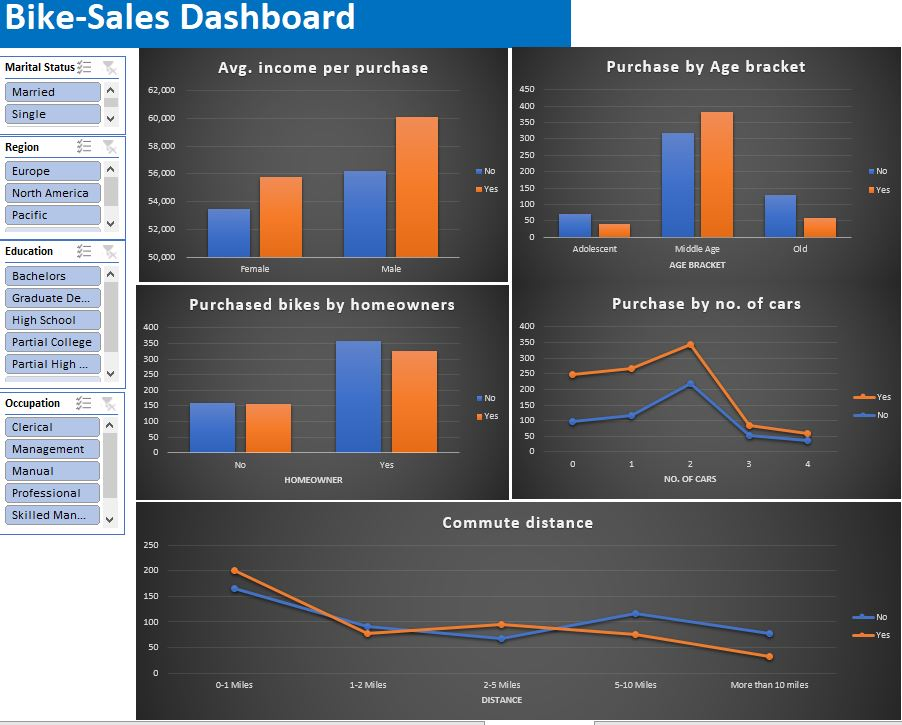

# Uptown Stores Analysis

## Introduction
This is an Excel project on sales analysis of an imaginary bike store called **Uptown Stores**. The aim of this project is to exhibit my skills in data cleaning, analysis and visualization. I came across this dataset online and admired how rich and tidy is as I have been trying to get my hands dirty with a rich dataset to practice my skills of data cleaning, analysis and visualization.

**_Disclaimer_**: All datasets and reports do not represent any company, institution or country, but just a dummy dataset to demonstrate capabilities of Excel.

## Problem Statement:

-	How far will a rider go before they decide to purchase a bike?
-	Which region makes the highest sales of bikes?
-	What age bracket purchased the most bikes?
-	Which gender and marital status purchased the highest number of bikes?
-	Which occupation produced the most purchase of bikes?
-	Any other relevant data-driven insights into the Bike sales Dataset

## Skills Demonstrated:
- Data cleaning, analysis and visualization
- Nested IF statement

## Data sourcing 
Not until I came up with the above questions did I get the data. I downloaded the dataset and opened with Excel. I then made a copy of the dataset and renamed it as “Working_sheet”.  It consists of 13 columns and 1026 rows.

## Data Transformation/cleaning:
Data was efficiently cleaned on Excel. Some of the steps included are:
- I removed duplicates.
- Changed the “M” & “S” to “Married” & “Single” and “M” and “F” to “Male” & “Female” in the “Marital Status”and “Gender” columns respectively.
- Changed the Income column to currency format; removed decimals and added a comma.
- Created a new column, named “Age bracket” for the Age column with this nested IF statement: =IF(L2>54,"Old",IF(L2>=31,"Middle Age",IF(L2<31,"Adolescent","Invalid")))
- Made sure the data types of each column were in the correct formats

## Data Modelling 
No modelling was required since we need just a table/sheet for the analysis

## Analysis & Visualizations

Here are some insights:
1.	On the average, males earn more than females, which in turn played a part in both purchasing a bike or not. 
2.	The middle Age bracket is by far the group with the highest number of bike purchase
3.	There are more homeowners than non-homeowners. More homeowners do not purchase a bike than homeowners who purchase a bike. In addition, more non-homeowners do not purchase a bike than homeowners who purchase a bike.
4.	The more the number of cars an individual has, the less the number of bikes they purchase. Alternatively, Individuals with few numbers of cars, purchase bikes at a high rate. 

## Conclusion & Recommendation
- Older people should be encouraged to get and ride bikes. As much as it is a means of transportation, it is good to keep the body in shape; however, for short distances.
- Having a number of cars should not stop the purchase of bikes 

